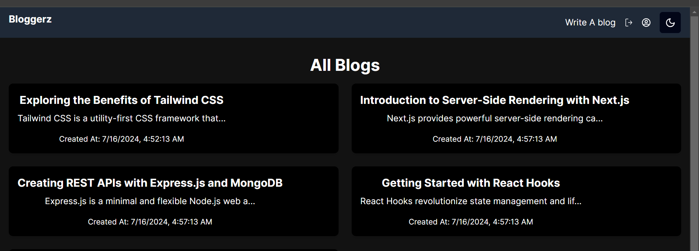
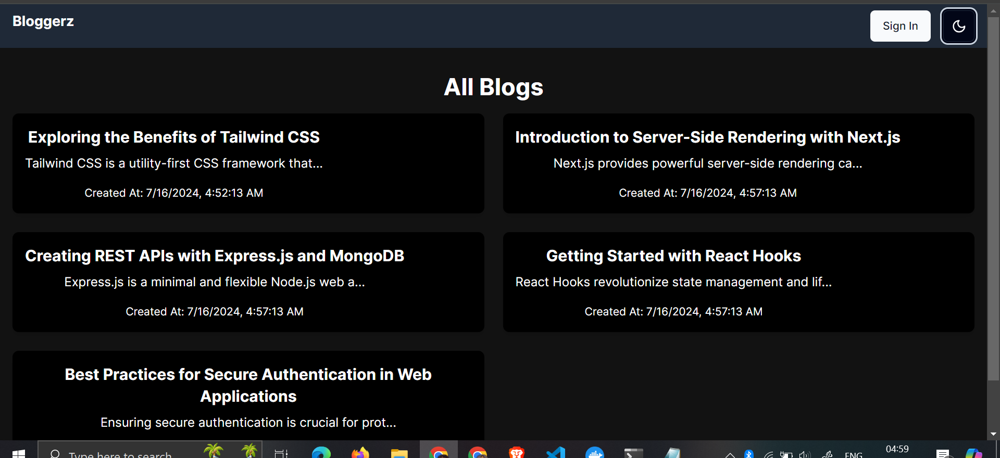
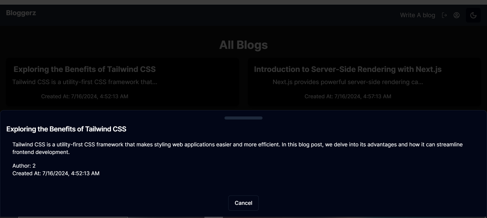
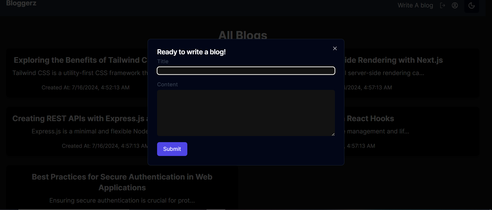
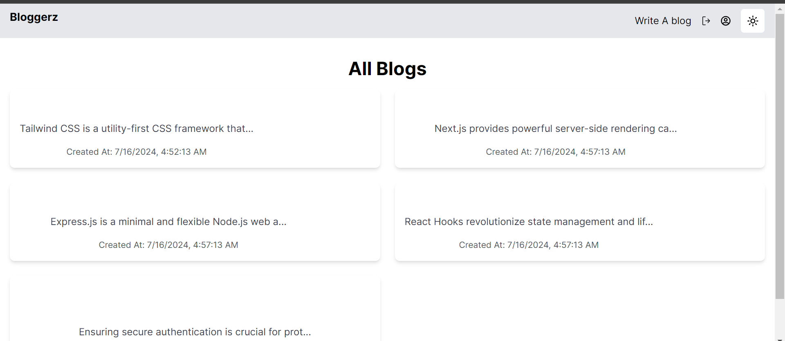

# Blog Website - Bloggerz

## Overview
This project is a blog website built using Next.js for the frontend and Next.js for server-side rendering and API handling. It allows users to view, create, and manage blog posts.

## Features
- **User Authentication**: Users can sign up, sign in, and manage their profiles.
- **Blog Management**: CRUD operations for blog posts.
- **Responsive Design**: Tailwind CSS used for responsive and modern UI.
- **Dark and Light Mode**: Toggle between dark and light themes for enhanced user experience.
- **Component Shadowing**: Utilizes Tailwind CSS for adding shadows to components.
- **Server-Side Rendering**: Utilizes Next.js for server-side rendering of pages and API routes.
- **Database**: Stores blog data using a Prisma client connected to a PostgreSQL database.
- **Authentication**: NextAuth.js used for authentication management.

## Tech Stack
- **Frontend**: React, Next.js, Tailwind CSS
- **Backend**: Next.js
- **Database**: PostgreSQL
- **Authentication**: NextAuth.js

## API Endpoints
- **GET /api/blogs/allblogs**: Retrieves all blog posts.
- **POST /api/blogs/create**: Creates a new blog post.
- **PUT /api/blogs/update/:id**: Updates a specific blog post.
- **DELETE /api/blogs/delete/:id**: Deletes a specific blog post.

## Future Enhancements
- Implement comment sections for blog posts.
- Add categories or tags for better organization.
- Implement search functionality for blog posts.

